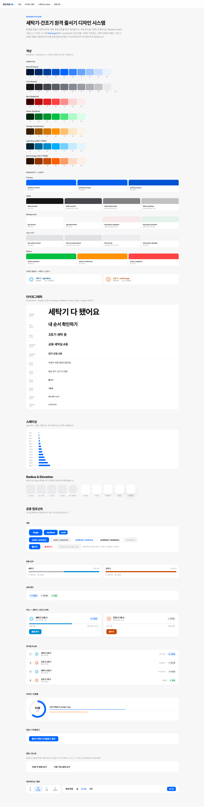
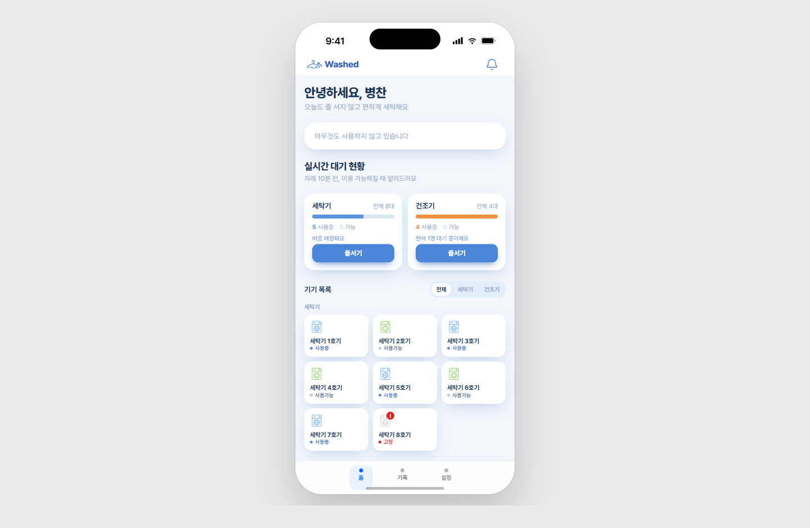
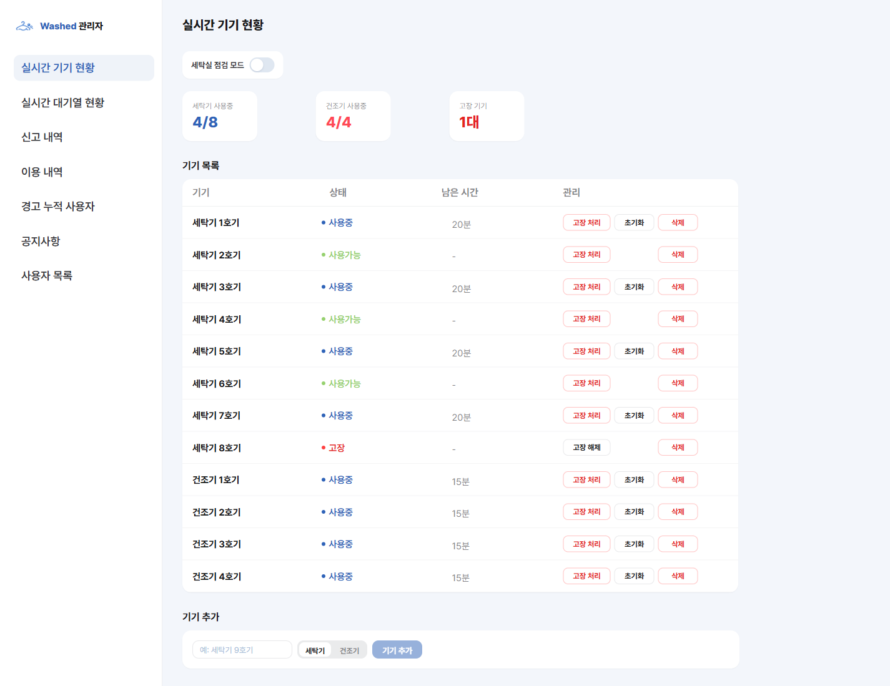
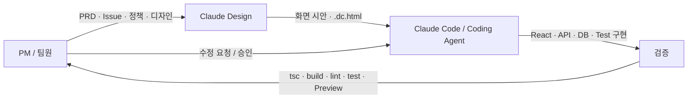
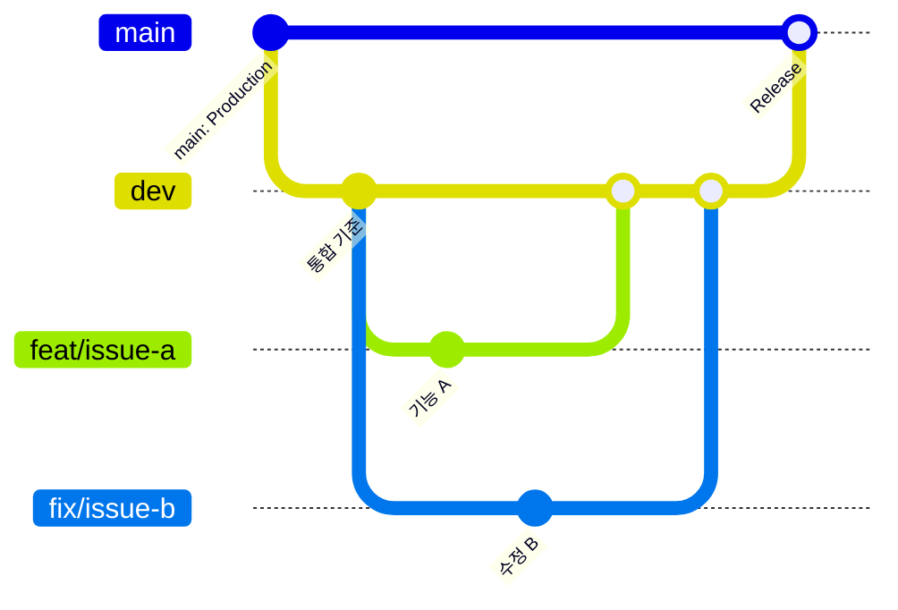
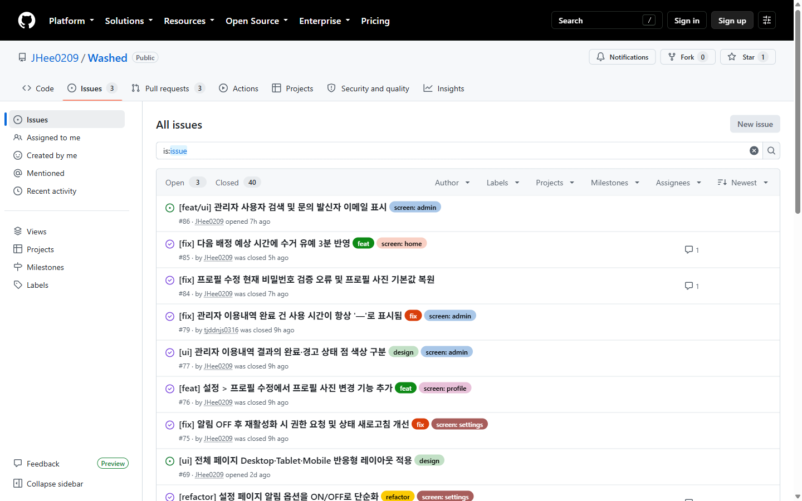
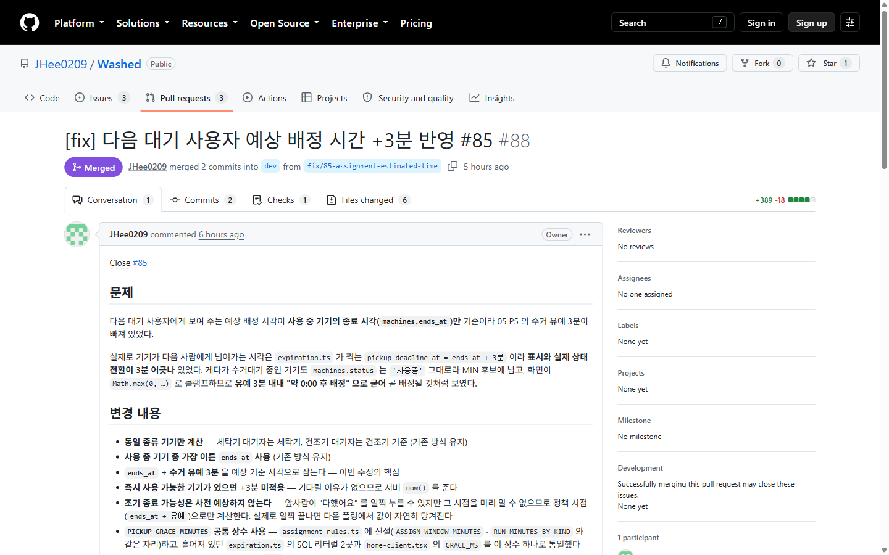

<!--
발표용 README.
2026-09-22 기준 실제 구현 상태로 작성함 — dev HEAD 기준.
Issue #13(다국어), #69(사용자 화면 반응형), #86(관리자 사용자 검색·문의 발신자 이메일)은
**아직 Open이며 구현 전**이다. 해당 항목은 ⏳ 표시로 구분해 두었다.
세 Issue가 merge되면 ⏳ 항목과 캡처, Closed/Open 수치를 실제값으로 갱신할 것.
-->

# 🫧 Washed

> 기숙사 공용 세탁기·건조기를 사용하는 학생의 **헛걸음과 순서 문제를 원격 줄서기·자동 배정·QR 인증·알림으로 해결하는 서비스**

| 항목 | 내용 |
|---|---|
| 팀명 | **2BA** |
| 팀원 | **정주희(프로젝트 통합·백엔드/인증·알림), 서수영(백엔드·DB/인프라·테스트), 이서연(프론트엔드·계정/설정·관리자 UI), 조성원(대기열·관리자 기능·데이터 연동)** |
| 기간 | **2026.09.11 ~ 2026.09.21 (발표 기준)** |
| 배포 링크 | Dev Preview: `https://vibecoding2-git-dev-zoohi.vercel.app` |
| 피그마 | **사용 안 함** |
| Claude Design | `https://claude.ai/design/p/37542e42-0d27-4c87-ae1b-023841b68cfc?file=%ED%99%88.dc.html&via=share` |
| GitHub | `https://github.com/JHee0209/Washed` |

> 기숙사 공용 세탁기·건조기의 **헛걸음·대기·순서 문제를 원격 줄서기, 자동 배정, QR 인증, 알림으로 해결하는 서비스**

---

## 1. 프로젝트 소개

### 문제 정의
- 타깃 사용자: **기숙사 공용 세탁기·건조기를 이용하는 학생**
- 겪는 문제:
  - 빈 기기가 있는지 확인하려면 직접 세탁실에 내려가야 함
  - 모든 기기가 사용 중이면 언제 다시 내려가야 할지 알기 어려움
  - 여러 사용자가 기다릴 때 명확한 순서 관리가 어려움
  - 자신의 차례·사용 종료·수거 시점을 계속 직접 확인해야 함
- 우리의 해결:
  - **실시간 기기 현황 → 원격 줄서기 → FIFO 자동 배정 → QR 인증 → 사용 타이머 → Push/앱 알림 → 이용 기록**을 하나의 흐름으로 연결

### MVP 기능
| 우선순위 | 기능 | 상태 |
|---|---|---|
| 1 | 로그인·세션 기반 사용자 인증 | ✅ 완료 |
| 2 | 실시간 세탁기·건조기 상태 조회 | ✅ 완료 |
| 3 | 세탁기/건조기 원격 줄서기 | ✅ 완료 |
| 4 | FIFO 자동 배정 및 중복 배정 방지 | ✅ 완료 |
| 5 | QR 카메라 인증 및 서버 검증 | ✅ 완료 |
| 6 | 사용 타이머·종료·수거·만료 처리 | ✅ 완료 |
| 7 | Web Push 및 앱 알림함 | ✅ 완료 |
| 8 | 이용기록·신고·경고 연동 | ✅ 완료 |
| 9 | 관리자 운영 콘솔 | ✅ 1차 완료 |
| 10 | 네 언어 다국어(한국어·English·中文·日本語) | ⏳ 구현 예정 · Issue #13 — 언어 선택 UI만 있고 화면 번역 미연결 |
| 11 | 사용자 화면 Desktop·Tablet·Mobile 반응형 | ⏳ 구현 예정 · Issue #69 — 현재 390px 고정 중심 UI (관리자 화면은 #69 범위 밖, Desktop 웹 전용 유지) |
| 12 | 관리자 사용자 검색·문의 발신자 이메일 | ⏳ 구현 예정 · Issue #86 |

### 범위에서 제외한 것
- **회전 QR / 일회성 QR 토큰** — 현재 MVP는 정적 QR + HMAC 검증으로 구현
- **위치 기반 현장 인증** — MVP 범위를 넘어서는 위치 권한·정확도·운영 정책이 필요
- **완전한 QR 재사용 방지** — 사진으로 보관한 QR을 다른 장소에서 재사용하는 문제는 후속 개선 대상으로 둠

### 정상 흐름
1. **로그인**
2. **홈에서 기기 현황 확인**
3. 사용 가능한 기기가 없으면 **세탁기/건조기 줄서기**
4. 차례가 되면 서버가 **사용 가능한 기기 자동 배정**
5. **Push/앱 알림** 확인
6. 세탁실에서 **배정 기기 QR 스캔**
7. 서버 검증 후 **사용 시작·타이머**
8. 사용 종료 후 **수거**
9. **이용 기록 저장**
10. 다음 대기 사용자에게 **자동 배정**

### 예외 흐름
| 상황 | 사용자에게 보이는 것 | 다음 행동 | 구현 여부 |
|---|---|---|---|
| 로그인 정보가 잘못됨 | 통합된 로그인 오류 안내 | 정보 확인 후 재시도 | ✅ |
| 학교 이메일이 아님 | 학교 계정이 아니라는 안내 | `.ac.kr` 학교 계정 사용 | ✅ |
| 다른 기기의 QR을 스캔 | 배정 기기와 일치하지 않는다는 오류 | 배정받은 기기 QR 재스캔 | ✅ |
| 배정 후 10분 내 QR 미인증 | 배정 만료·경고 처리 | 다시 줄서기 | ✅ |
| 사용 종료 후 3분 내 미수거 | 수거 만료·경고 처리 | 정책에 따라 이용 상태 종료 | ✅ |
| Push 권한이 꺼짐 | 브라우저 권한/앱 알림 상태 안내 | 권한 또는 Washed 알림 재활성화 | ✅ |
| 관리자 사용자 검색 결과 없음 | 자연스러운 빈 상태 | 검색어 변경/삭제 | ⏳ 구현 예정 · Issue #86 |
| API/DB 저장 실패 | 기능별 오류 문구 | 재시도 | ✅ 주요 흐름 적용 / 화면별 추가 점검 필요 |

### 기획 문서
- [문제 정의](docs/01-problem.md)
- [워크플로](docs/02-workflow.md)
- [요구사항](docs/03-requirements.md)
- [기능 정의](docs/04-features.md)
- [정책](docs/05-policy.md)
- [데이터](docs/06-data.md)
- [화면 정의](docs/07-screens.md)
- [배포/운영 메모](docs/08-deployNOTE.md)
- [PRD](docs/PRD.md)

---

## 2. 디자인 시스템

- Claude Design 공유본: `https://claude.ai/design/p/37542e42-0d27-4c87-ae1b-023841b68cfc?file=%ED%99%88.dc.html&via=share`

> 아래 이미지는 Playwright/Claude Code로 캡처 후 넣을 예정



### 사용 도구와 역할
| 도구 | 어느 단계에 썼나 | 원본 여부 |
|---|---|---|
| 피그마 | 사용하지 않음 | 미사용 |
| Claude Design | 로그인·홈·기록·설정·관리자 등 초기 화면 설계 및 `.dc.html` 산출물 제작 | 디자인 원본/참고 자료 |
| React + Tailwind CSS | 실제 서비스 화면 구현 | 최종 구현 |
| `docs/07-screens.md` | 디자인 정책·화면 요구사항 기준 | 문서 원본 |
| `src/app/globals.css` | 실제 코드에서 사용하는 디자인 토큰 | 코드 단일 원본 |

### 정의
| 구분 | 정의 | 디자인 문서 | 실제 구현 |
|---|---|---|---|
| Primary | `#5B93E0` | ✅ | ✅ |
| Primary Strong | `#2F63B8` | ✅ | ✅ |
| Background | `#F3F6FB` | ✅ | ✅ |
| Surface | `#FFFFFF` | ✅ | ✅ |
| Text | `#1E3557` | ✅ | ✅ |
| Success | `#188A5E` | ✅ | ✅ |
| Warning | `#F0913F` | ✅ | ✅ |
| Danger | `#E0554E` | ✅ | ✅ |
| 타이포 | Pretendard 우선, 시스템 폰트 + Noto Sans SC/JP fallback | ✅ | ✅ |
| 글자 크기 | 12 / 13 / 14 / 15 / 17 / 20px | ✅ | ✅ |
| Radius | 12 / 14 / 16 / 20 / full | ✅ | ✅ |
| 최소 터치 영역 | 44px | ✅ | ✅ |

### 컴포넌트 목록
- Primary / Google / Disabled Button
- Input Field
- Machine Card
- Status Badge
- Queue
- Timer
- Modal / Bottom Sheet
- Toast
- Header
- Bottom Navigation
- Notification Bell
- Profile Avatar
- Admin Table / Filter

### 디자인 vs 구현
| Claude Design | 실제 화면 |
|---|---|
|  | <br>⏳ **Issue #69 반응형 구현 후 캡처 예정** |
|  | <br>⏳ **최종 구현 후 캡처 예정** (관리자는 #69 범위 밖 · Desktop 웹 전용) |

> 피그마는 이번 프로젝트에서 사용하지 않았으므로 비교 표는 **Claude Design ↔ 실제 구현** 중심으로 구성한다. 실제 화면 캡처는 **Issue #69 사용자 화면 반응형 적용 후** 최종 상태로 찍을 예정이라 현재는 비어 있다 — 지금 찍으면 발표용 최종 화면과 달라진다.

---

## 3. Agent 구성



### 역할별 Agent
| Agent | 역할 | 입력 | 출력 | 제약 |
|---|---|---|---|---|
| Claude Design | UI/UX 구조와 초기 화면 시안 제작 | 화면 요구사항, 디자인 정책 | `.dc.html`, 디자인 시스템, 화면 시안 | 정책에 없는 기능 임의 추가 금지 |
| Claude Code | 기능 조사·구현·테스트·Git 작업 보조 | GitHub Issue, `docs/`, `CLAUDE.md` | React/TS 코드, API, 테스트, migration, 검증 보고 | 승인 전 commit/push/PR/merge 금지, Issue 범위 밖 수정 금지 |
| GitHub/Vercel | 통합·Preview 검증 | 작업 브랜치/PR | PR, Preview 배포, Checks | `dev` 통합, `main` Production 분리 |

### 지시문 핵심 발췌
```text
작업 기준은 GitHub Issue와 docs/ 문서다.
문서에 없는 정책은 임의로 만들지 말고 사용자에게 확인한다.
모든 작업 브랜치는 최신 dev에서 시작한다.
dev/main 직접 push 및 force push를 금지한다.
PR base는 항상 dev로 한다.
working tree가 dirty하면 임의로 switch/pull/reset하지 않는다.
DB write 전 실제 Neon branch를 반드시 확인한다.
Production DB migration/write는 명시적 승인 없이 수행하지 않는다.
구현 후 tsc → build → lint → test → git diff → git status를 확인한다.
PR merge는 사용자의 명시적 승인 후에만 수행한다.
```

### 지시문 수정 이력
- **v1 → v2**: 과거 `integration-total` 중심 흐름에서 **`dev` 통합 / `main` Production** 구조로 변경
- **v2 → v3**: dirty working tree에서 임의 `switch/pull/reset`하지 않는 안전 규칙 추가
- **v3 → v4**: DB migration과 코드 merge를 분리하고 **Neon branch ID 확인** 절차 강화
- **v4 → 현재**: commit/push/PR/merge 단계별 승인, 신규 lint 오류와 기존 baseline 분리, Issue 범위 밖 수정 금지 명시
- **다음 단계(⏳ 예정)**: 다국어(#13), 사용자 화면 반응형(#69), 관리자 검색·문의 발신자 이메일(#86)도 같은 하네스 규칙으로 구현·검증·통합할 계획

---

## 4. 프로젝트 규칙 (하네스)

### CLAUDE.md 핵심
- 코드 컨벤션
  - 변수·함수·타입·파일명: 영어
  - 사용자 UI 문구: 한국어 기본
  - 설명용 주석: 한국어
  - TypeScript 오류를 남기지 않음
- 폴더 구조
  - `src/app/`: Next.js 화면 및 Route Handler
  - `src/app/api/`: 서버 API
  - `src/lib/`: DB 접근·정책·비즈니스 로직
  - `src/components/`: 재사용 UI
  - `db/schema.sql`: 현재 전체 DB schema
  - `db/migrations/`: migration
  - `docs/`: 요구사항·정책 문서
  - `.claude/skills/`: 반복 작업용 Skill
- 금지 사항
  - `dev` / `main` 직접 push 금지
  - force push 금지
  - `integration-total` 신규 사용 금지
  - `.env.local` 커밋 금지
  - credential 출력/커밋 금지
  - 승인 없는 commit/push/PR/merge 금지
  - 테스트 통과만을 위한 하드코딩 금지

### 만들어 둔 Skill / 재사용 프롬프트
| 이름 | 하는 일 | 사용 횟수 |
|---|---|---|
| `issue-inplementation` | Issue 내용을 기준으로 구현 범위·선행 의존성·수정 파일을 확인하고 작업 | 반복 사용 · 정확한 횟수 미집계 |
| `pre-pr-check` | PR 전 변경 파일·검증 결과·Git 상태를 점검 | 반복 사용 · 정확한 횟수 미집계 |
| Issue 작업 프롬프트 | 담당자·브랜치·DB 안전 규칙·검증·PR 범위를 한 번에 전달 | 반복 사용 |
| Merge 전 검증 프롬프트 | conflict/check/base/head/변경 범위 확인 후 승인 전 정지 | 반복 사용 |

### 검증 절차
1. `git status` / 현재 브랜치 확인
2. GitHub Issue 원문과 구현 범위 비교
3. `npx tsc --noEmit`
4. `npm run build`
5. `npm run lint`
6. `npm test`
7. 변경 파일 lint 신규 오류 확인
8. `git diff` / `git diff --check`
9. `git status`
10. DB 관련 기능은 Neon branch ID와 migration status를 별도 확인
11. PR 생성 후 Vercel Preview 및 GitHub Checks 확인

**실제 사례**: PR #89를 최신 `dev`와 합치는 과정에서 `test/resolve-hooks.mjs` 충돌이 발생했다. 한쪽 변경을 통째로 선택하지 않고 #84의 `next/cache`, #85의 `next/navigation`, #86의 `next/headers` 목적을 각각 확인해 모두 보존한 뒤 전체 테스트·TypeScript·build를 다시 실행했다.

---

## 5. 협업 방식

### 브랜치 전략



- 브랜치 종류:
  - `main`: 최종 Production
  - `dev`: 실제 통합 브랜치
  - `feat/<이슈번호>-<기능명>`
  - `fix/<이슈번호>-<기능명>`
  - `refactor/<이슈번호>-<기능명>`
  - `chore/<이슈번호>-<기능명>`
  - 필요 시 `docs/`, `test/`
- 브랜치 시작: **항상 최신 `dev`**
- 합치기 규칙: 작업 브랜치 → PR(base=`dev`) → 검증 → 승인 → merge
- Production 반영: 검증된 `dev` → 별도 `main` PR → Production 검증 후 merge
- `integration-total`: 과거 브랜치로 신규 작업에 사용하지 않음

### 이슈 활용
| 이슈 | 내용 | 연결 PR 예시 | 상태 |
|---|---|---|---|
| #58 | 핵심 상태 전환 E2E 회귀 테스트 | #81 | ✅ 완료 |
| #66 | 만료 스케줄러 자동 실행·홈 반영 | #74 등 | ✅ 완료 |
| #75 | 알림 OFF 후 재활성화 | #83 | ✅ 완료 |
| #84 | 비밀번호 검증·프로필 사진 기본값 복원 | #87 | ✅ 완료 |
| #85 | 다음 배정 예상 시간 +3분 | #88 | ✅ 완료 |
| #86 1차 | 문의 관리자 연동·날짜 필터 | #89 | ✅ `dev` 반영 |
| #86 후속 | 관리자 사용자 검색·문의 발신자 이메일 | — | ⏳ 구현 예정 |
| #13 | 네 언어 이식 | — | ⏳ 구현 예정 |
| #69 | 사용자 화면 반응형 UI (관리자 제외) | — | ⏳ 구현 예정 |

- 이슈 템플릿: **있음**
- 위치: `.github/ISSUE_TEMPLATE/기능-개발-이슈-양식.md`

### 현재 Issue 현황 (2026-09-22 기준)

**전체 43개 · ✅ Closed 40개 · 🟡 Open 3개**

| Issue | 내용 | 상태 |
|---|---|---|
| [#13](https://github.com/JHee0209/Washed/issues/13) | 다국어 네 언어 이식 (한국어·English·中文·日本語) | ⏳ 구현 예정 |
| [#69](https://github.com/JHee0209/Washed/issues/69) | 사용자 페이지 Desktop·Tablet·Mobile 반응형 | ⏳ 구현 예정 |
| [#86](https://github.com/JHee0209/Washed/issues/86) | 관리자 사용자 검색 및 문의 발신자 이메일 표시 | ⏳ 구현 예정 |

- 세 Issue가 merge되면 Closed/Open 수치와 최종 commit SHA를 실제값으로 갱신



### PR 활용
- PR 템플릿: `.github/pull_request_template.md` (**있음**)
- PR 본문 기본 항목:
  - 연관 Issue / `Close #`
  - 작업 내용
  - UI 변경 시 스크린샷
  - Vercel Preview 테스트 방법
- 리뷰/merge 규칙:
  - base/head 확인
  - conflict 확인
  - GitHub Checks/Vercel Preview 확인
  - Issue 범위와 변경 파일 비교
  - 사용자의 명시적 승인 후 merge
- 2026-09-21 조회 기준 총 PR: **47개**
- merged PR: **42개**
- 발표 시점 기준 README/발표 자산과 기능 작업은 `dev`에 통합 완료
- 정식 리뷰 코멘트 수: **최종 발표 직전 실제 GitHub 기준으로 별도 집계**

### 역할 분담

> 역할은 직함을 임의로 붙인 것이 아니라, 실제 GitHub Issue/PR에서 반복적으로 맡아 온 작업 영역을 기준으로 정리했다.

| 팀원 | GitHub 계정 | 담당 영역 | 대표 PR |
|---|---|---|---|
| **정주희** | `JHee0209` | **프로젝트 통합·백엔드/인증·알림** — 로그인/인증, 홈·기기 상태, 사용 종료, Push, 이메일 운영 검증, 경고 시각, 예상 배정 시간, README/통합 흐름 관리 | #15, #16, #17, #23, #27, #70, #71, #73, #83, #88, #90 등 |
| **서수영** | `tjtndud2` | **백엔드·DB/인프라·테스트** — QR 인증, 만료 Scheduler, 세션 리팩터링, Google 로그인, 관리자 사용자 가입 방식, migration 상태 자동화, E2E 회귀 테스트 | #18, #22, #24, #26, #40, #50, #61, #63, #74, #81 등 |
| **이서연** | `skinopero` | **프론트엔드·계정/설정·관리자 UI** — 로그인/로그아웃 흐름, 사용 타이머, 관리자 전체 점검·상태 정합성, 알림 설정, 프로필 사진·비밀번호 검증 | #38, #42, #52, #60, #72, #80, #87 등 |
| **조성원** | `tjddnjs0316` | **대기열·관리자 기능·데이터 연동** — 줄서기/배정, 알림 읽음 상태, 관리자 기기 사용자, 이용내역 UI·시간 계산, 사용자 문의 관리자 연동 | #19, #21, #36, #41, #51, #78, #82, #89 등 |

### 병렬 작업 방법
- 하나의 큰 기능을 여러 사람이 같은 파일에서 동시에 수정하기보다 **Issue 단위로 분리**
- 각 작업자는 최신 `dev`에서 독립 브랜치 생성
- 기능이 서로 의존하면 선행 PR을 `dev`에 합친 뒤 다음 작업 시작
- 동시에 수정한 공통 파일에서 충돌이 발생하면 **ours/theirs 전체 선택 금지**, 각 Issue 목적을 비교해 필요한 변경을 모두 보존
- DB migration은 번호·적용 상태를 공유하고 Preview/dev DB에서 순서를 맞춤

### 충돌 해결 사례
- PR #89를 최신 `dev`와 동기화하면서 `test/resolve-hooks.mjs` 충돌 발생
- #84·#85·#86이 각각 추가한 resolver 목적을 확인
- `next/cache`, `next/navigation`, `next/headers` 처리를 모두 유지하도록 수동 병합
- 이후 전체 test / TypeScript / build 재검증 후 feature branch에 push
- PR이 다시 `MERGEABLE / CLEAN` 상태가 된 것을 확인한 뒤 merge



---

## 6. 데모

### 실행 방법

**배포 Preview**
- `https://vibecoding2-git-dev-zoohi.vercel.app`

**로컬**
```bash
npm install
npm run dev
```

> DB가 필요한 로컬 검증은 `.env.local`이 올바른 Preview/dev Neon branch를 가리키는지 먼저 확인한다.

### 시연 순서
1. 로그인
2. 홈 — 실제 세탁기/건조기 상태 확인
3. 사용 가능한 기기가 없을 때 원격 줄서기
4. 다음 사용자 자동 배정
5. 배정 알림
6. 실제 기기 QR 인증
7. 사용 타이머 및 `다했어요`
8. 알림함 / 읽음 상태
9. 기록 / 경고 확인
10. 설정 / 알림 ON·OFF
11. 관리자 — 기기·대기열·사용자·신고·경고·공지·이용내역·문의
12. 관리자 사용자 검색 — 이름·이메일·학번 부분 검색 및 빈 상태 확인 — ⏳ **Issue #86 완료 후 시연 예정**
13. 문의 탭 — 실제 사용자 이메일 표시 확인 — ⏳ **Issue #86 완료 후 시연 예정**
14. 언어 전환 — 한국어 / English / 中文 / 日本語 — ⏳ **Issue #13 완료 후 시연 예정**
15. 반응형 — Mobile / Tablet / Desktop 화면 비교 — ⏳ **Issue #69 완료 후 시연 예정**

> 1~11번은 현재 구현된 범위이고, 12~15번은 위 세 Issue가 끝난 뒤 시연 항목으로 추가한다.

### 데모 캡처 추천
| 파일 | 캡처 대상 | 상태 |
|---|---|---|
| `docs/images/design-system.png` | 디자인 시스템 | ✅ 캡처 완료 |
| `docs/images/cdesign-home.png` | Claude Design 홈 원본 | ✅ 캡처 완료 |
| `docs/images/cdesign-admin.png` | Claude Design 관리자 원본 | ✅ 캡처 완료 |
| `docs/images/real-login.png` | 로그인 | ✅ 캡처 완료 |
| `docs/images/issues.png` | GitHub Issues | ✅ 캡처 완료 |
| `docs/images/pr.png` | GitHub PR | ✅ 캡처 완료 |
| `docs/images/real-home.png` | 홈/기기 상태 | ⏳ #69 후 캡처 예정 |
| `docs/images/real-queue.png` | 줄서기/배정 상태 | ⏳ #69 후 캡처 예정 |
| `docs/images/real-notifications.png` | 알림함 | ⏳ #69 후 캡처 예정 |
| `docs/images/real-history.png` | 기록 | ⏳ #69 후 캡처 예정 |
| `docs/images/real-settings.png` | 설정 | ⏳ #69 후 캡처 예정 |
| `docs/images/real-admin.png` | 관리자 콘솔 | ⏳ 최종 구현 후 캡처 예정 (관리자는 #69 범위 밖) |
| `docs/images/real-responsive.png` | 사용자 화면 Mobile·Tablet·Desktop 비교 | ⏳ #69 후 캡처 예정 |
| `docs/images/real-i18n.png` | 네 언어 전환 화면 | ⏳ #13 후 캡처 예정 |
| `docs/images/real-admin-search.png` | 관리자 사용자 검색 + 문의 이메일 | ⏳ #86 후 캡처 예정 |

> 실제 서비스 화면(`real-*`)은 **Issue #69 사용자 화면 반응형 적용 후 최종 상태로 한 번에 캡처**한다 — 지금 찍으면 발표용 최종 화면과 달라진다. `real-i18n`은 #13, `real-admin-search`는 #86 완료가 선행 조건이며, 관리자 콘솔은 #69 범위 밖이라 Desktop 웹 기준으로 찍는다.

---

## 7. 회고

### 잘 된 점
- 정적 프로토타입의 `localStorage`·가짜 배열을 실제 세션·API·PostgreSQL 데이터로 단계적으로 교체
- 클라이언트가 아닌 서버에서 배정·만료·권한·시간 정책을 판정하도록 구조 개선
- GitHub Issue를 작은 작업 단위로 쪼개 여러 명이 병렬 개발
- `CLAUDE.md`와 Skill로 Claude Code의 Git·DB·검증 행동을 표준화
- Vercel Preview를 통해 PR 단위로 실제 배포 화면 확인
- migration 상태 검사 스크립트와 회귀 테스트를 추가해 DB/상태 머신 변경의 위험을 낮춤

### 후속 구현 예정 (현재 진행 중인 개선)
- ⏳ **Issue #13** — 한국어·영어·중국어·일본어 4개 언어를 실제 화면에 연결하고 기기 단위 언어 설정 유지. 현재는 언어 선택 UI만 있고 화면 문구는 한국어 고정이다
- ⏳ **Issue #69** — 390px 고정 중심의 사용자 화면을 Mobile·Tablet·Desktop 반응형 레이아웃으로 확장. 관리자 화면은 이번 범위에서 제외하고 Desktop 웹 전용으로 유지한다
- ⏳ **Issue #86** — 관리자 사용자 검색과 문의 발신자 이메일 표시를 연결해 운영 편의성 보완. 문의 관리자 연동·이용 내역 날짜 필터(1차)는 PR #89로 이미 `dev`에 반영됐다

### 실패 사례와 개선
| 무엇이 실패했나 | 왜 | 어떻게 고쳤나 |
|---|---|---|
| 초기 화면의 가짜 데이터·localStorage | 여러 사용자가 같은 상태를 공유할 수 없음 | 실제 DB/API 조회·서버 상태로 이전 |
| 클라이언트 중심 배정 판단 | 동시 접근 시 중복 배정 위험 | 서버/DB 중심 자동 배정으로 변경 |
| GET 조회 과정에서 상태 변경 | 단순 조회가 side effect를 발생시킬 수 있음 | 조회와 상태 변경 로직 분리(#35) |
| 자동 만료가 브라우저 실행 상태에 의존 | 사용자가 앱을 닫으면 시간 정책이 깨질 수 있음 | scheduler/cron 기반 서버 처리 |
| Push 권한과 서비스 구독 상태 혼동 | 브라우저 `permission=granted`만으로 실제 수신 가능 여부를 알 수 없음 | PushSubscription과 브라우저 권한을 분리 |
| 여러 Issue가 공통 resolver 파일 수정 | 최신 `dev` 병합 시 conflict | Issue별 변경 목적을 확인해 수동 통합 후 전체 회귀 검증 |
| DB branch 혼동 위험 | Preview/Production 연결 문자열이 여러 환경에 존재 | migration 전 Neon branch ID와 status를 반드시 확인 |

### 팀 안에서 공유한 Claude 활용 노하우
- Issue 원문과 `docs/`를 프롬프트에 같이 제공
- 담당자·브랜치명·PR base·금지사항을 프롬프트 첫 부분에 고정
- “구현부터 하지 말고 현재 구조 조사 → 예상 수정 파일 → 구현” 순서 사용
- commit / push / PR / merge를 한 번에 맡기지 않고 승인 지점을 분리
- Claude의 “완료” 보고를 그대로 믿지 않고 Git diff·test·Preview·DB를 다시 확인
- DB write가 필요한 작업은 branch ID 확인 전 실행 금지
- conflict는 한쪽 전체 선택 대신 각 Issue의 의도를 비교
- 결과 보고 형식을 고정해 팀원이 다른 PC에서 작업해도 같은 방식으로 검증

### 다음 프로젝트에서 다르게 할 것
1. 프로젝트 시작부터 `main` / `dev` / feature branch 전략을 확정해 중간 브랜치 전환 비용을 없앤다.
2. 초기 프로토타입 단계부터 실제 데이터 모델과 API 경계를 먼저 정의해 가짜 데이터 제거 작업을 줄인다.
3. E2E 테스트와 브라우저 캡처 자동화를 초기에 도입해 UI 회귀를 PR마다 확인한다.
4. Preview / Production 환경변수와 DB branch 매핑을 문서 한 곳에서 관리하고 자동 검증한다.
5. 디자인 시스템과 실제 React token을 처음부터 단일 원본으로 맞춰 후반 반응형·다국어 확장 비용을 줄인다.

---

## 발표 전 채워야 할 항목

- [x] 팀명: 2BA
- [x] 팀원 이름 + 역할
- [x] GitHub 계정 ↔ 실제 팀원 이름 매핑
- [x] 프로젝트 시작일: 2026.09.11
- [x] Figma: 사용 안 함
- [x] Claude Design 공유 URL 반영
- [x] Playwright로 현재 구현 상태 캡처 6개 추가 (디자인 시스템 · Claude Design 홈/관리자 · 로그인 · Issues · PR)
- [ ] ⏳ #13 · #69 · #86 구현/merge 후 나머지 `real-*` 캡처 9개 추가
- [ ] ⏳ #13 · #69 · #86 merge 후 GitHub Closed/Open 수치와 최종 commit SHA를 실제값으로 갱신
- [ ] README/발표 자산 PR merge 후 최종 기준 commit/status 갱신
- [ ] `dev → main` Production 반영 전 최종 상태 갱신
- [ ] 발표 직전 GitHub Open Issue 목록을 다시 확인 (2026-09-22 기준 Open 3개: #13 · #69 · #86)
