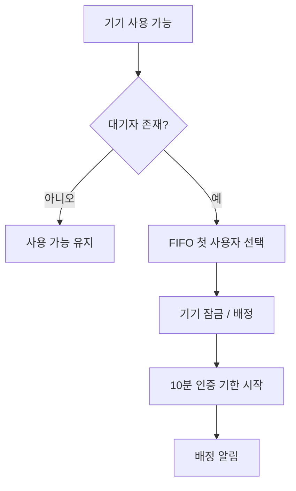
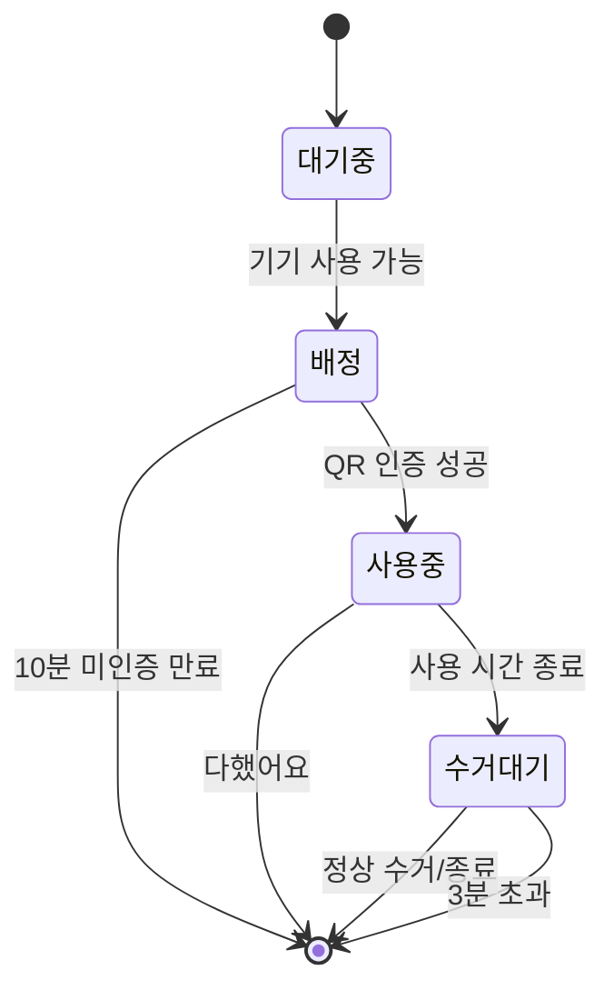
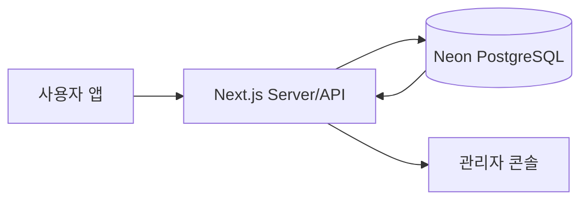
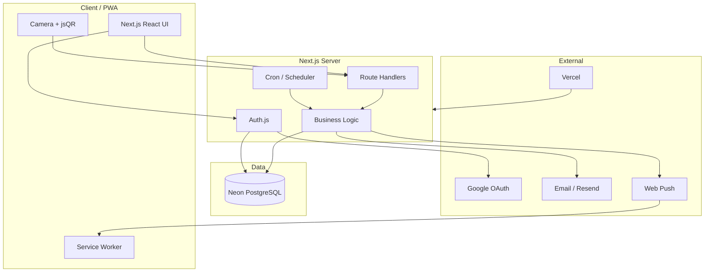
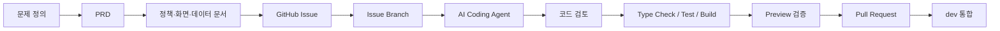

<div align="center">


# 🫧 Washed

### 기숙사 공용 세탁기·건조기를 위한 원격 줄서기 · 자동 배정 · QR 인증 서비스

**“세탁실에 직접 내려가 확인하던 줄을, 앱 속 대기열로 옮기다.”**

[GitHub Repository](https://github.com/JHee0209/Washed) · [Issues](https://github.com/JHee0209/Washed/issues)

</div>

---

> **발표 자료 작성 기준**
>
> - 기준 브랜치: `dev`
> - 기준 HEAD: `346ee3b` — PR #88 / Issue #85 반영 직후
> - 기준일: **2026-09-21**
> - GitHub Issues: **총 43개 / Closed 40개 / Open 3개**
> - 현재 Open: **#13 다국어**, **#69 반응형 UI**, **#86 문의 관리자 연동 + 이용내역 날짜 필터**
> - Issue #86은 **PR #89가 Open 상태**이며 아직 `dev`에 병합되지 않은 작업으로 구분한다.
>
> 이 README는 발표 시 그대로 위에서 아래로 내려가며 설명할 수 있도록  
> **문제 → 해결 → 사용자 흐름 → 핵심 기능 → 기술 구조 → 바이브코딩 방식 → 시행착오 → 현재 상태 → 전체 Issue 이력** 순서로 구성했다.

---

# 0. 발표 한눈에 보기

| 순서 | 발표 내용 | 핵심 메시지 |
|---|---|---|
| 1 | 프로젝트 소개 | Washed는 기숙사 공용 세탁기의 “헛걸음과 순서 문제”를 해결한다 |
| 2 | 문제 정의 | 빈 기기, 남은 시간, 대기 순서를 직접 내려가야만 알 수 있었다 |
| 3 | 해결 방식 | 원격 줄서기 → 자동 배정 → QR 인증 → 사용 → 알림 |
| 4 | 사용자 기능 시연 | 로그인, 홈, 줄서기, QR, 타이머, 기록, 알림, 설정 |
| 5 | 관리자 기능 시연 | 기기·대기열·사용자·신고·경고·공지·이용내역 관리 |
| 6 | 시스템 구조 | Next.js + Auth.js + Neon PostgreSQL + Web Push + Vercel |
| 7 | 바이브코딩 방식 | PRD/Docs → Issue → Branch → AI Coding Agent → 검증 → PR |
| 8 | 주요 시행착오 | 가짜 데이터, 중복 배정, 시간 판정, cron, migration, 알림 상태 |
| 9 | 결과와 남은 과제 | 43개 Issue 중 40개 완료, 3개 후속 작업 |

---

# 1. 프로젝트 소개

## 왜 만들었나요?

기숙사 세탁실을 사용하는 학생은 **빈 세탁기나 건조기가 있는지 직접 내려가 보기 전까지 알기 어렵습니다.**

기기가 모두 사용 중이면 다시 방으로 돌아가야 하고,  
언제 끝나는지 몰라 여러 번 내려가 확인하기도 합니다.

여러 사람이 동시에 기다리고 있을 경우에는  
**누가 먼저 사용할 차례인지 정하는 명확한 기준도 없습니다.**

### 기존 이용 방식

```text
빨래를 들고 세탁실로 이동
          ↓
빈 기기 확인
          ↓
     기기 없음
          ↓
다시 방으로 돌아감
          ↓
시간이 지난 뒤 다시 내려감
```

### Washed가 만들고 싶은 경험

```text
방에서 앱 확인
      ↓
원격 줄서기
      ↓
내 차례 알림
      ↓
세탁실 이동
      ↓
QR 인증
      ↓
기기 사용
```

> ### 발표 포인트
> Washed의 핵심은 “세탁을 대신 해주는 서비스”가 아닙니다.  
> **이미 기숙사에 있는 공용 세탁기·건조기를 여러 사람이 더 편리하고 공정하게 쓰도록 만드는 서비스**입니다.

---

# 2. 문제 정의

프로젝트의 문제는 네 가지로 정리했습니다.

| 구분 | 내용 |
|---|---|
| **문제** | 빈 기계가 있는지 알려면 직접 세탁실에 가야 한다 |
| **대상** | 기숙사 공용 세탁실을 사용하는 학생 |
| **기존 방식** | 직접 확인하거나 세탁실 앞에서 기다린다 |
| **불편** | 헛걸음, 반복 확인, 남은 시간 불확실, 순서 다툼 |

우리가 해결하려고 한 핵심 질문은 다음과 같습니다.

> **“세탁기 앞에 직접 서 있지 않아도 공정하게 줄을 설 수 없을까?”**

---

# 3. Washed의 해결 방법

Washed는 공용 세탁기 이용 전체 과정을 하나의 흐름으로 연결합니다.


사용자가 특정 호기의 세탁기를 미리 선점하는 방식이 아니라,  
**세탁기 / 건조기 종류별 FIFO 대기열에 들어가고 시스템이 사용 가능한 기기를 자동 배정**합니다.

---

# 4. 핵심 사용자 시나리오

## STEP 1. 로그인

Washed는 실제 사용자 계정을 기반으로 동작합니다.

구현된 인증 흐름:

- 일반 회원가입 / Credentials 로그인 — Issue #2
- 세션 기반 사용자 정보 통일 — Issue #14
- 로그인 진입 및 로그아웃 처리 — Issue #29
- Google 간편 로그인 및 신규 가입 연결 — Issue #33
- 이메일 인증 / 비밀번호 찾기 실제 발송 검증 — Issue #67
- 프로필 수정 및 프로필 사진 — Issue #76, #84

사용자 이름·학번·호실 등은 화면에 하드코딩하지 않고  
**현재 로그인한 세션 사용자와 DB 정보를 기준으로 표시**합니다.

---

## STEP 2. 실시간 기기 현황 확인

홈 화면에서 세탁기와 건조기의 상태를 확인합니다.

- 전체 / 세탁기 / 건조기 필터
- 사용 가능
- 배정
- 사용 중
- 수거 대기
- 고장 / 점검
- 대기 인원
- 예상 배정 시간

초기 프로토타입의 가짜 배열을 제거하고  
실제 `machines`, `queue` 데이터를 조회하도록 변경했습니다.

관련 Issue:

- #3 홈 기기 현황 DB 연동
- #48 관리자 기기별 현재 사용자 표시
- #54 · #55 관리자 기기 상태 정합성 개선
- #85 다음 배정 예상 시간에 수거 유예 3분 반영

---

## STEP 3. 원격 줄서기

사용하고 싶은 종류의 기기가 모두 사용 중이면  
앱에서 세탁기 또는 건조기 대기열에 참여합니다.

```text
세탁기 Queue

1. 사용자 A
2. 사용자 B
3. 사용자 C
```

정책:

- 세탁기 대기열 1개
- 건조기 대기열 1개
- 같은 종류에서 FIFO 순서 유지
- 줄에서 빠진 뒤 다시 서면 맨 뒤로 이동
- 이용 제한 / 시설 점검 상태에서는 신규 이용 제한
- 즉시 사용 가능한 기기가 있으면 불필요한 대기 인원으로 계산하지 않음

관련 Issue:

- #4 줄서기 · 줄 빠지기 서버 API
- #5 배정 판정 서버화
- #47 세탁실 전체 점검
- #58 핵심 상태 전환 E2E 회귀 테스트

---

## STEP 4. 자동 배정

기기가 비면 서버가 다음 사용자를 자동으로 배정합니다.



### 왜 서버에서 배정하나요?

초기에는 각 브라우저가 자신의 화면을 기준으로 다음 사용자를 판단했습니다.

사용자가 여러 명일 경우  
**동일한 기기에 두 명이 동시에 배정될 수 있는 위험**이 있었습니다.

Issue #5에서 배정 판정을 서버로 옮기고  
동시성에 안전한 DB 처리 방식으로 변경했습니다.

---

# 5. QR 인증

배정됐다고 바로 사용 상태가 되는 것은 아닙니다.

사용자는 실제 세탁실에 이동해  
**배정된 기기에 부착된 QR 코드를 스캔해야 합니다.**

관련 Issue:

- #6 실제 카메라 QR 인증 + 서버 검증
- #30 QR 인증과 DB 상태 연동 검증
- #56 잘못된 기기 ID 및 상태 예외 처리
- #57 수거대기 상태의 QR 재인증 오류 문구 개선

## QR 검증 항목

서버는 다음을 확인합니다.

```text
QR 서명 검증
    ↓
존재하는 기기인가?
    ↓
현재 사용자가 배정받은 기기인가?
    ↓
다른 사용자의 배정은 아닌가?
    ↓
배정 후 10분 이내인가?
    ↓
사용 시작
```

현재 QR은 **정적 QR + HMAC 서명 방식**입니다.

- 임의로 만든 QR 값은 서버 검증에서 거부
- QR 위조 방지
- 배정 사용자 / 기기 일치 검증
- 인증 시간 검증

### 알려진 한계

현재 구조에서는 QR 사진을 미리 촬영해 다른 장소에서 재사용하는 것을 완전히 막지 않습니다.

회전 QR, 일회성 토큰, 위치 기반 검증 등은 현재 범위에서 제외하고  
향후 개선 항목으로 남겼습니다.

---

# 6. 사용 타이머와 상태 머신

QR 인증이 성공하면 실제 사용이 시작됩니다.

현재 정책:

| 항목 | 시간 |
|---|---:|
| 세탁기 사용 시간 | 60분 |
| 건조기 사용 시간 | 45분 |
| 배정 후 QR 인증 기한 | 10분 |
| 사용 종료 후 수거 유예 | 3분 |

핵심 상태는 다음과 같습니다.



관련 Issue:

- #7 사용 종료 · `다했어요`
- #8 만료 스케줄러 · 자동 경고
- #34 사용 종료 타이머 전환 로직 단일화
- #35 GET 조회와 상태 변경 로직 분리
- #58 상태 전환 E2E 회귀 테스트
- #66 만료 스케줄러 자동 실행 및 홈 반영
- #85 예상 배정 시간 정합성

---

# 7. 자동 만료와 경고

앱을 계속 켜 두지 않아도 서버가 시간 만료를 처리해야 합니다.

## 배정 후 10분 동안 QR 미인증

```text
배정
 ↓
10분 초과
 ↓
자동 경고 1회
 ↓
기존 배정 해제
 ↓
다음 대기자 자동 배정
```

## 사용 종료 후 3분 동안 미수거

```text
사용 시간 종료
 ↓
수거대기
 ↓
3분 초과
 ↓
자동 경고 1회
 ↓
사용 상태 종료
 ↓
다음 대기자 처리
```

경고는 중복 이벤트가 발생해도  
**같은 사건에 대해 중복 부여되지 않도록 멱등성을 고려**했습니다.

경고 관련 개선:

- #8 자동 만료/경고
- #28 관리자 경고 사용자 정보 연동
- #53 경고 ↔ 알림함 ↔ 이용기록 연동
- #54 관리자 경고 내역 정합성
- #65 관리자 화면과 사용자 알림의 경고 시각 통일

---

# 8. Web Push 알림

Washed에서 가장 중요한 UX 중 하나는  
**사용자가 계속 앱을 열어 확인하지 않아도 자신의 차례를 알 수 있게 하는 것**입니다.

구현 기술:

- Service Worker
- Push Subscription
- Web Push API
- `web-push`
- DB `push_subscriptions`

알림 예시:

- 내 차례가 됐을 때
- QR 인증이 필요할 때
- 사용 시간이 종료됐을 때
- 수거가 필요할 때
- 경고 발생
- 신고 처리 결과
- 관리자 공지

관련 Issue:

- #12 배정 · 종료 Push 연결
- #31 읽음 상태 및 빨간 점
- #53 경고 알림 연동
- #65 경고 표시 시각 통일
- #68 알림 설정을 실제 ON/OFF 하나로 단순화
- #75 OFF → ON 재활성화 및 브라우저 권한 상태 동기화

## 브라우저 권한과 Washed ON/OFF를 분리

```text
브라우저 Notification.permission
+
Washed PushSubscription 존재 여부
=
실제 알림 가능 여부
```

브라우저 권한이 `granted`여도 사용자가 Washed 알림을 OFF하면  
PushSubscription을 해제하여 알림을 받지 않습니다.

---

# 9. 알림함

앱 내부에서도 모든 주요 이벤트를 확인할 수 있습니다.

- 읽지 않은 알림이 있으면 종 아이콘에 빨간 점
- 알림을 확인하면 DB의 `is_read` 갱신
- 모두 읽으면 빨간 점 제거
- 새 알림이 생기면 다시 표시
- 새로고침 후에도 DB 상태 유지

Issue #31에서 **화면 로컬 상태가 아니라 실제 DB 알림 상태와 UI를 연결**했습니다.

---

# 10. 신고 시스템

공용 공간에서는 기술만으로 해결하기 어려운 문제도 발생합니다.

예:

- 세탁물이 장시간 방치됨
- 순서를 지키지 않음
- 다른 사람의 이용을 방해함

Washed에서는 사용자가 신고를 접수하고  
관리자가 처리할 수 있도록 구성했습니다.

Issue #10:

- 신고 DB 저장
- 로그인 사용자 기준 신고자 연결
- 증거 사진 업로드
- 특정 신고 사유에서 사진 필수
- 신고 처리 결과 알림

---

# 11. 이용 기록

사용자는 자신의 실제 사용 이력과 경고 내역을 확인할 수 있습니다.

Issue #9에서

```text
샘플 배열 / localStorage
        ↓
실제 DB 조회
```

로 교체했습니다.

관리자도 실제 `usage_history`를 기준으로 이용 내역을 확인합니다.

관리자 이용내역 개선:

- #77 `완료` / `경고` 상태 점 색상 구분
- #79 완료 건 사용 시간 계산 오류 수정
- #86 날짜 필터 추가 — **현재 Open / PR #89 리뷰 중**

---

# 12. 프로필과 사용자 계정

사용자 계정 화면도 실제 DB 사용자와 연결됩니다.

기능:

- 이름
- 학번
- 호실
- 비밀번호 변경
- 프로필 사진 업로드
- 프로필 사진 기본값 복원

관련 Issue:

- #14 실제 세션 사용자 정보 표시
- #76 프로필 사진 변경
- #84 현재 비밀번호 검증 + 사진 기본값 복원

---

# 13. 관리자 콘솔

Washed는 사용자 앱만 있는 것이 아니라  
**기숙사 행정/관리자를 위한 별도의 운영 콘솔**을 제공합니다.



## 관리자 주요 기능

| 기능 | 설명 | 관련 Issue |
|---|---|---|
| 실시간 기기 현황 | 실제 세탁기·건조기 상태 조회 | #3, #48, #54, #55 |
| 현재 사용자 | 현재 실제 사용 중인 사용자 확인 | #48, #55 |
| 대기열 | 실제 queue 기준 대기 상태 확인 | #4 |
| 시설 전체 점검 | 모든 기기의 신규 이용 차단 / 해제 | #47 |
| 신고 관리 | 신고 내용 및 처리 상태 확인 | #10 |
| 경고 관리 | 사용자별 경고 사유와 제한 상태 확인 | #28, #53, #54, #65 |
| 사용자 관리 | 이름·학번·호실·가입 방식 조회 | #28, #46 |
| 가입 방식 | `구글` / `회원가입` 두 값으로 표시 | #46 |
| 공지 | 사용자 알림으로 전달할 공지 관리 | 프로젝트 MVP |
| 이용 내역 | 완료/경고·사용시간 조회 | #77, #79 |
| 문의하기 | 사용자 문의 전용 탭 | #86 — Open |

---

# 14. 세탁실 전체 점검

관리자가 세탁실 전체에 문제가 있다고 판단하면  
모든 세탁기와 건조기의 신규 사용을 제한할 수 있습니다.

Issue #47에서:

- 전체 점검 시작
- 사용자 화면 반영
- 신규 줄서기 / 배정 제한
- 기존 사용 세션은 정상 종료
- 점검 해제 후 정상 이용 재개

를 구현했습니다.

---

# 15. 데이터가 어떻게 연결되나요?

초기 프로토타입에서는 여러 화면이 `localStorage` 또는 샘플 배열을 사용했습니다.

이 방식은 한 사람의 브라우저에서는 동작하지만  
여러 사용자가 동시에 쓰는 실제 서비스에서는 같은 상태를 공유할 수 없습니다.

그래서 프로젝트를 진행하며 핵심 데이터를 DB 중심으로 이전했습니다.

```text
users
machines
queue
warnings
usage_restrictions
reports
notifications
push_subscriptions
usage_history
admins
notices
email_verifications
```

> ### 발표 포인트
> 이 프로젝트의 큰 변화는 “예쁜 프로토타입”에서 끝난 것이 아니라  
> **화면의 임시 상태를 실제 서버·DB 상태로 하나씩 교체한 과정**입니다.

---

# 16. 시스템 아키텍처



---

# 17. 기술 스택

## Frontend

- **Next.js 16.3.4**
- **React 19.2.8**
- **TypeScript 5**
- **Tailwind CSS 4**

## Authentication

- **Auth.js / NextAuth 5 beta**
- Credentials 로그인
- Google OAuth
- 학교 이메일 검증
- 이메일 OTP 인증 / 비밀번호 재설정

## Backend

- Next.js App Router
- Server Components
- Route Handlers
- Server-side Business Logic

## Database

- **PostgreSQL**
- **Neon Serverless PostgreSQL**
- SQL Migration 관리

## Notification / PWA

- Service Worker
- Web Push API
- `web-push`
- `manifest.json`

## QR

- 카메라 기반 QR 스캔
- `jsQR`
- HMAC-SHA256 서명 검증

## Test / Quality

- Node.js `node:test`
- PGlite
- TypeScript type check
- ESLint
- Next.js production build
- DB migration status checker

## Deployment

- **Vercel**
- Preview / Development / Production 환경 분리

---

# 18. 프로젝트 폴더 구조

```text
Washed/
│
├── src/
│   ├── app/
│   │   ├── login/
│   │   ├── signup/
│   │   ├── password-reset/
│   │   ├── home/
│   │   ├── notifications/
│   │   ├── history/
│   │   ├── settings/
│   │   ├── profile/
│   │   ├── support/
│   │   ├── withdraw/
│   │   ├── admin/
│   │   └── api/
│   │       ├── auth/
│   │       ├── machines/
│   │       ├── queue/
│   │       ├── notifications/
│   │       ├── push/
│   │       ├── reports/
│   │       ├── profile/
│   │       └── cron/
│   │
│   ├── components/
│   │   ├── admin/
│   │   ├── app-shell.tsx
│   │   ├── machine-filter.tsx
│   │   ├── notification-bell.tsx
│   │   └── notification-prompt.tsx
│   │
│   └── lib/
│       └── DB 접근 · 정책 · 인증 · 배정 · 사용 · 알림 로직
│
├── db/
│   ├── schema.sql
│   └── migrations/
│
├── scripts/
│   ├── db-migrate.mjs
│   ├── db-migrate-status.mjs
│   ├── db-check.mjs
│   └── print-machine-qr.mjs
│
├── docs/
│   ├── 01-problem.md
│   ├── 02-workflow.md
│   ├── 03-requirements.md
│   ├── 04-features.md
│   ├── 05-policy.md
│   ├── 06-data.md
│   ├── 07-screens.md
│   ├── 08-deployNOTE.md
│   └── PRD.md
│
├── public/
│   ├── icons/
│   ├── manifest.json
│   └── sw.js
│
├── CLAUDE.md
└── README.md
```

---

# 19. DB Migration 관리

개발 도중 스키마가 계속 바뀌면서  
“코드에는 migration이 있는데 실제 DB에는 적용되지 않은 상태”가 발생할 수 있었습니다.

Issue #59에서 이를 보완했습니다.

## 현재 방식

```text
Repository migration files
          ↕ 비교
schema_migrations table
```

읽기 전용 상태 확인을 통해

- 적용된 migration
- 미적용 migration
- 파일과 장부의 불일치

를 확인할 수 있도록 했습니다.

### 핵심 원칙

Production DB에 migration을 자동 실행하지 않습니다.

```text
상태 확인
 ↓
대상 DB branch 확인
 ↓
Preview/Test 검증
 ↓
사람이 승인
 ↓
적용
```

---

# 20. 데이터 보관 정책

현재 프로젝트 문서 기준 주요 보관 정책:

| 데이터 | 정책 |
|---|---|
| 이용 내역 | 3개월 |
| 신고 및 증거 | 3개월 |
| 경고 기록 | 1개월 |
| 일반 알림 | 30일 |
| 공지 | 3개월 |
| 회원탈퇴 | 신청 후 14일 유예 후 삭제 |

Issue #11에서  
단순히 화면에서 오래된 데이터를 숨기는 것이 아니라  
**실제 삭제 배치와 회원탈퇴 유예 처리**를 구현하는 방향으로 정리했습니다.

---

# 21. 우리가 사용한 바이브코딩 방식

이 프로젝트는 AI Coding Agent를 적극 활용했지만  
단순히 한 문장으로 전체 앱을 만들어 달라고 요청하지 않았습니다.

## 우리가 사용한 흐름



---

# 22. AI에게 프로젝트를 이해시킨 방법

프로젝트 루트의 `CLAUDE.md`를 AI의 공통 개발 규칙으로 사용했습니다.

AI에게 매번 모든 규칙을 다시 설명하는 대신  
저장소 자체가 프로젝트의 컨텍스트가 되도록 구성했습니다.

## `CLAUDE.md`에 정의한 내용

- 프로젝트 개요
- 브랜치 전략
- Issue 작업 규칙
- 코드 컨벤션
- DB migration 규칙
- DB 테스트 안전 규칙
- 검증 절차
- PR / Merge 규칙
- 금지 사항
- 결과 보고 형식

그리고 세부 제품 규칙은 `docs/`로 분리했습니다.

```text
01-problem      왜 만드는가
02-workflow     사용자는 어떻게 움직이는가
03-requirements 무엇이 필요한가
04-features     어떤 기능을 만드는가
05-policy       서비스 규칙은 무엇인가
06-data         무엇을 저장하는가
07-screens      화면은 어떻게 구성되는가
08-deployNOTE   실제 구현에서 무엇이 달라졌는가
PRD             최종 요구사항
```

> ### 발표 포인트
> AI가 대화 기억에만 의존하지 않고  
> **저장소에 있는 문서와 규칙을 다시 읽어서 같은 기준으로 작업하게 만든 것**이 핵심입니다.

---

# 23. GitHub Issue 기반 개발

Washed의 기능 개발은 **Issue 하나를 하나의 작업 단위**로 사용했습니다.

```text
Issue 생성
   ↓
최신 dev 확인
   ↓
feat/fix/refactor/chore 브랜치 생성
   ↓
AI와 구현
   ↓
직접 테스트
   ↓
commit / push
   ↓
Pull Request → dev
   ↓
검토 후 merge
```

현재 팀 규칙:

- `main` = Production
- `dev` = 통합 브랜치
- `integration-total` = 폐기
- 기능 브랜치는 항상 최신 `dev`에서 생성
- PR base는 `dev`
- `dev` / `main` 직접 push 금지
- force push 금지
- 승인 전 merge 금지
- dirty working tree에서 임의 switch/pull 금지

---

# 24. 구현 후 검증 루틴

AI가 “완료”라고 말하는 것으로 작업을 끝내지 않았습니다.

기본 검증:

```bash
npx tsc --noEmit
npm run build
npm run lint
npm test
git diff --check
git status
```

DB 기능은 추가로

- 실제 DB 행 확인
- 중복 데이터 여부
- orphan state 여부
- 같은 요청을 두 번 보내도 안전한지
- Preview/Test DB 사용 여부
- Neon branch ID 확인

까지 검증했습니다.

---

# 25. 가장 큰 시행착오 ① — 가짜 데이터에서 실제 데이터로

## 문제

초기 화면은 빠르게 UI를 만들기 위해

- 샘플 배열
- 고정 사용자 이름
- `localStorage`

를 많이 사용했습니다.

한 브라우저에서는 정상처럼 보였지만  
여러 사용자가 동시에 사용할 수 있는 서비스는 아니었습니다.

## 해결

Issue #3, #4, #9, #10, #14 등을 통해  
기능을 하나씩 실제 DB와 로그인 세션으로 교체했습니다.

### 배운 점

> 화면이 움직이는 것과 실제 서비스가 동작하는 것은 다릅니다.

---

# 26. 시행착오 ② — 중복 배정

## 문제

각 브라우저가 다음 사용자를 스스로 판단하면  
두 사용자가 동시에 같은 기기를 사용할 수 있다고 판단할 수 있었습니다.

## 해결

Issue #5에서

- 배정 판단 서버화
- DB 상태 기반 처리
- 동시성 고려
- 같은 기기 중복 배정 방지

로 구조를 변경했습니다.

---

# 27. 시행착오 ③ — 클라이언트 시간에 의존

## 문제

`Date.now()`를 기준으로 사용자의 브라우저가 만료를 판단하면

- 기기 시계 차이
- 앱 종료
- 백그라운드 상태
- 사용자가 앱을 열지 않는 상황

에서 정확한 상태 처리가 어렵습니다.

## 해결

배정 / 사용 / 수거 / 만료 판정을  
**서버 시각과 DB timestamp 중심**으로 변경했습니다.

관련 Issue:

- #5
- #7
- #8
- #34
- #66
- #85

---

# 28. 시행착오 ④ — 화면을 열어야만 만료가 되는 구조

## 문제

자동 경고 로직이 존재해도  
실제로 scheduler가 실행되지 않으면 사용자가 앱을 열지 않는 동안 상태가 바뀌지 않습니다.

## 해결

Issue #66에서

- cron 실행 구조
- 자동 만료
- QR 미인증
- 사용시간 종료
- 수거 대기 만료
- FIFO 다음 사용자 배정
- 홈 polling 반영

을 하나의 서버 상태 흐름으로 검증했습니다.

---

# 29. 시행착오 ⑤ — GET 요청이 DB를 바꾸는 문제

## 문제

초기에는 `GET /api/queue` 안에서 만료 처리까지 실행했습니다.

홈 화면이 자주 polling하기 때문에  
**단순 조회가 DB write까지 발생시키는 구조**였습니다.

## 해결

Issue #35에서

```text
조회(Read)
≠
상태 변경(Mutation)
```

으로 역할을 분리했습니다.

자동 상태 변경은 scheduler 쪽에서 처리하고  
GET은 조회 역할에 집중하도록 했습니다.

---

# 30. 시행착오 ⑥ — 같은 “사용중”도 의미가 달랐다

## 문제

`machines.status='사용중'`은 중복 배정을 막기 위한 락 역할도 했습니다.

그래서 QR 인증 전 “배정” 상태인데도  
관리자 화면에서는 실제 사용중처럼 보일 수 있었습니다.

## 해결

Issue #54, #55에서

- machine 상태
- queue 상태
- `ends_at`
- 실제 사용자

를 함께 확인하여  
**관리자 UI의 표시 의미와 서버 내부 락 의미를 분리**했습니다.

---

# 31. 시행착오 ⑦ — 알림 권한과 알림 구독은 다르다

## 문제

브라우저의 알림 권한이 `granted`라고 해서  
현재 Washed의 PushSubscription이 존재한다는 뜻은 아닙니다.

## 해결

Issue #68, #75에서

- 브라우저 permission
- 실제 PushSubscription
- 서버 구독 데이터

를 별도로 관리했습니다.

### 배운 점

> UI 토글의 상태는 “권한”이 아니라  
> 실제 서비스가 사용할 수 있는 상태와 일치해야 합니다.

---

# 32. 시행착오 ⑧ — 같은 경고인데 시간이 달랐다

## 문제

관리자 화면은 `warnings.issued_at`,  
알림함은 `notifications.received_at`을 사용했습니다.

같은 사건인데 화면마다 시간이 미세하게 달랐습니다.

## 해결

Issue #65에서  
`warnings.issued_at`을 경고 발생 시간의 **Single Source of Truth**로 사용했습니다.

---

# 33. 시행착오 ⑨ — Migration Drift

## 문제

여러 브랜치가 동시에 DB migration을 추가하면서

```text
Repository
≠
Preview DB
≠
Production DB
```

상태가 될 위험이 있었습니다.

## 해결

Issue #59에서 migration 상태 확인 도구와 절차를 추가했습니다.

### 배운 점

> 코드를 최신화하는 것과 DB 스키마를 최신화하는 것은 별개의 작업입니다.

---

# 34. 테스트 전략

Issue #58에서 핵심 사용자 흐름 전체를 회귀 테스트 대상으로 잡았습니다.

검증 시나리오:

### 정상 사용

```text
줄서기
→ 배정
→ QR
→ 사용중
→ 다했어요
→ 종료
```

### QR 미인증

```text
배정
→ 10분 초과
→ 경고
→ 배정 해제
→ 다음 사용자
```

### 사용시간 만료

```text
사용중
→ 60/45분 종료
→ 수거대기
→ 3분 초과
→ 경고
→ 다음 사용자
```

### 멱등성

동일 scheduler가 반복 실행돼도

- 중복 경고 없음
- 중복 배정 없음
- queue 중복 없음
- 잘못된 `ends_at` 없음

을 확인합니다.

---

# 35. 현재 구현 상태

## GitHub Issue 기준

<div align="center">

### **43 Issues**

**✅ Closed 40** · **🟡 Open 3**

</div>

### 현재 Open

| Issue | 상태 | 내용 |
|---|---|---|
| [#13](https://github.com/JHee0209/Washed/issues/13) | 🟡 Open | 한국어 · English · 中文 · 日本語 실제 번역 이식 |
| [#69](https://github.com/JHee0209/Washed/issues/69) | 🟡 Open | Desktop · Tablet · Mobile 전체 반응형 |
| [#86](https://github.com/JHee0209/Washed/issues/86) | 🟠 Open / PR #89 | 사용자 문의 관리자 연동 + 문의 탭 + 이용내역 날짜 필터 |

## #86 상태 주의

Issue #86은 구현 브랜치와 **PR #89가 열려 있지만 아직 `dev`에 merge되지 않았습니다.**

따라서 발표 시:

- “구현 완료”라고 단정하지 않고
- **“현재 리뷰 및 통합 대기 중인 마지막 개선 작업”**

이라고 설명하는 것이 정확합니다.

---

# 36. 앞으로 개선할 부분

## #13 다국어

현재 UI에 일부 언어 선택 구조는 있지만  
실제 전체 화면의 키 기반 다국어 전환은 아직 Open입니다.

목표:

- 한국어
- English
- 中文
- 日本語
- 번역 사전
- 중국어/일본어 글꼴
- 약관 번역 정합성

---

## #69 반응형 UI

초기 디자인은 390px 모바일 프레임을 중심으로 제작했습니다.

다음 단계에서는

- Mobile
- Tablet
- Desktop
- 관리자 테이블
- Modal
- 긴 텍스트
- viewport overflow

까지 전체 반응형으로 개선합니다.

---

## #86 문의 관리자 연동

사용자가 문의를 제출한 뒤  
관리자가 별도의 문의 탭에서 확인할 수 있도록 개선하는 작업입니다.

함께 추가되는 기능:

- 문의 DB 저장/조회 경로 정합성
- 관리자 문의 탭
- 문의 사용자 / 내용 / 시각 표시
- 이용 내역 날짜 필터

현재 PR #89 검토 상태입니다.

---

# 37. 프로젝트 성과

이 프로젝트에서 단순히 화면을 만든 것보다 중요했던 것은  
**서비스가 실제 여러 사용자에게 동작하기 위해 필요한 문제를 계속 발견하고 고친 과정**입니다.

### 초기

```text
UI
+ localStorage
+ 가짜 데이터
```

### 현재

```text
실제 로그인/세션
+ PostgreSQL
+ 서버 대기열
+ 자동 배정
+ QR 검증
+ 시간 기반 상태 머신
+ Scheduler
+ Web Push
+ 관리자 콘솔
+ Migration 관리
+ 회귀 테스트
```

---

# 38. 한 줄 결론

> **Washed는 세탁기 앞에 직접 서 있던 줄을 앱 속 대기열로 옮기고,  
> 서버 기반 자동 배정과 QR 인증·알림·관리자 운영까지 연결한 기숙사 공용 세탁실 관리 서비스입니다.**

---

# 39. 발표 시연 추천 순서

실제 서비스 화면을 보여줄 경우 아래 순서가 가장 자연스럽습니다.

### ① 로그인

일반 또는 Google 로그인

↓

### ② 홈

세탁기 / 건조기 현재 상태 확인

↓

### ③ 줄서기

사용 가능한 기기가 없을 때 대기열 참여

↓

### ④ 배정

내 차례가 되면 자동 배정 + 알림

↓

### ⑤ QR

배정된 기기 실제 QR 스캔

↓

### ⑥ 사용

사용 타이머 및 `다했어요`

↓

### ⑦ 알림 / 기록

이용내역, 경고, 알림 읽음 상태

↓

### ⑧ 관리자

기기 → 현재 사용자 → 대기열 → 신고 → 경고 → 사용자 → 이용내역

---

# 40. 발표 마무리 멘트 예시

> 처음에는 기숙사 세탁실의 불편을 해결하기 위한 단순한 아이디어에서 시작했습니다.  
> 하지만 실제 서비스를 만들면서 여러 사용자가 동시에 접근하는 문제, 서버 시간, QR 인증, 자동 만료, 알림 권한, DB migration처럼 화면만으로는 보이지 않는 문제들을 계속 발견했습니다.
>
> 저희는 이 문제들을 GitHub Issue로 하나씩 분리하고, 문서와 AI Coding Agent를 활용해 구현한 뒤 직접 테스트하는 방식으로 프로젝트를 발전시켰습니다.
>
> 현재 GitHub 기준 43개의 Issue 중 40개를 완료했고, 다국어·반응형·문의 관리 기능을 후속 개선으로 진행하고 있습니다.
>
> **Washed는 ‘세탁실에 내려가서 기다리는 경험’을 ‘내 차례에 맞춰 내려가는 경험’으로 바꾸는 것을 목표로 합니다.**

---

# Appendix A. 전체 GitHub Issue 이력

> 아래 표는 **2026-09-21 GitHub Issue 상태 기준**입니다.  
> 발표 본문에서는 기능 영역별로 묶어 설명하고, 질의응답 시 이 표를 근거로 개발 이력을 보여줄 수 있습니다.

| Issue | 상태 | 내용 |
|---|---|---|
| [#2](https://github.com/JHee0209/Washed/issues/2) | ✅ Closed | `[feat]` 로그인 화면을 Credentials 로그인에 연결 |
| [#3](https://github.com/JHee0209/Washed/issues/3) | ✅ Closed | `[feat]` 홈 기기 현황을 DB 조회로 교체 |
| [#4](https://github.com/JHee0209/Washed/issues/4) | ✅ Closed | `[feat]` 줄서기 · 줄 빠지기 서버 API |
| [#5](https://github.com/JHee0209/Washed/issues/5) | ✅ Closed | `[feat]` 배정 판정 서버화 · 중복 배정 방지 |
| [#6](https://github.com/JHee0209/Washed/issues/6) | ✅ Closed | `[feat]` QR 인증 카메라 연결과 서버 검증 |
| [#7](https://github.com/JHee0209/Washed/issues/7) | ✅ Closed | `[feat]` 사용 종료 · `다했어요` 서버 처리 |
| [#8](https://github.com/JHee0209/Washed/issues/8) | ✅ Closed | `[feat]` 만료 스케줄러 · 경고 자동 부여 |
| [#9](https://github.com/JHee0209/Washed/issues/9) | ✅ Closed | `[feat]` 기록 화면을 DB 조회로 교체 |
| [#10](https://github.com/JHee0209/Washed/issues/10) | ✅ Closed | `[feat]` 신고 접수 API · 증거 사진 업로드 |
| [#11](https://github.com/JHee0209/Washed/issues/11) | ✅ Closed | `[feat]` 보관 기간 삭제 배치 · 회원탈퇴 14일 유예 |
| [#12](https://github.com/JHee0209/Washed/issues/12) | ✅ Closed | `[feat]` 배정 · 종료 푸시 발송 연결 |
| [#13](https://github.com/JHee0209/Washed/issues/13) | 🟡 Open | `[feat]` 다국어 네 언어 이식 |
| [#14](https://github.com/JHee0209/Washed/issues/14) | ✅ Closed | `[refactor]` 로그인 세션 기반 사용자 정보 표시 통일 |
| [#28](https://github.com/JHee0209/Washed/issues/28) | ✅ Closed | `[feat]` 관리자 경고 이용자와 사용자 정보 연동 |
| [#29](https://github.com/JHee0209/Washed/issues/29) | ✅ Closed | `[fix]` 로그인 진입 및 로그아웃 세션 처리 오류 수정 |
| [#30](https://github.com/JHee0209/Washed/issues/30) | ✅ Closed | `[fix]` QR 인증과 DB 기기·대기열 상태 연동 오류 수정 |
| [#31](https://github.com/JHee0209/Washed/issues/31) | ✅ Closed | `[fix]` 알림 목록과 읽음 상태·미확인 빨간 점 연동 |
| [#32](https://github.com/JHee0209/Washed/issues/32) | ✅ Closed | `[ui]` 홈 인사말 형식 통일 · 알림 문구 개선 |
| [#33](https://github.com/JHee0209/Washed/issues/33) | ✅ Closed | `[fix]` Google 간편 로그인 정상 동작 · 가입 연결 |
| [#34](https://github.com/JHee0209/Washed/issues/34) | ✅ Closed | `[refactor]` 사용 종료 타이머 전환 로직 단일화 |
| [#35](https://github.com/JHee0209/Washed/issues/35) | ✅ Closed | `[refactor]` GET `/api/queue` 조회와 상태 변경 로직 분리 |
| [#46](https://github.com/JHee0209/Washed/issues/46) | ✅ Closed | `[feat]` 관리자 사용자 목록 가입 방식 표시 |
| [#47](https://github.com/JHee0209/Washed/issues/47) | ✅ Closed | `[feat]` 관리자 세탁실 전체 점검 |
| [#48](https://github.com/JHee0209/Washed/issues/48) | ✅ Closed | `[feat]` 관리자 실시간 기기별 사용 사용자 표시 |
| [#53](https://github.com/JHee0209/Washed/issues/53) | ✅ Closed | `[fix]` 경고 발생 내역과 알림함 · 이용기록 연동 |
| [#54](https://github.com/JHee0209/Washed/issues/54) | ✅ Closed | `[fix]` 관리자 경고 · 실시간 기기 현황 데이터 정합성 |
| [#55](https://github.com/JHee0209/Washed/issues/55) | ✅ Closed | `[fix]` 관리자 실제 사용중 상태 판정 |
| [#56](https://github.com/JHee0209/Washed/issues/56) | ✅ Closed | `[fix]` 사용 종료 · QR 인증 상태 예외 처리 |
| [#57](https://github.com/JHee0209/Washed/issues/57) | ✅ Closed | `[fix]` 수거대기 QR 재인증 오류 사유 · 안내 문구 |
| [#58](https://github.com/JHee0209/Washed/issues/58) | ✅ Closed | `[test]` 배정 · QR · 사용 · 수거 · 만료 E2E 회귀 테스트 |
| [#59](https://github.com/JHee0209/Washed/issues/59) | ✅ Closed | `[chore]` DB migration 적용 상태 점검 자동화 |
| [#65](https://github.com/JHee0209/Washed/issues/65) | ✅ Closed | `[fix]` 관리자 경고 내역과 알림함의 경고 시각 통일 |
| [#66](https://github.com/JHee0209/Washed/issues/66) | ✅ Closed | `[fix]` 배정·수거 만료 스케줄러 자동 실행 및 홈 반영 |
| [#67](https://github.com/JHee0209/Washed/issues/67) | ✅ Closed | `[fix]` 회원가입·비밀번호 찾기 이메일 운영 검증 |
| [#68](https://github.com/JHee0209/Washed/issues/68) | ✅ Closed | `[refactor]` 설정 알림 옵션 실제 ON/OFF로 단순화 |
| [#69](https://github.com/JHee0209/Washed/issues/69) | 🟡 Open | `[ui]` 전체 Desktop·Tablet·Mobile 반응형 |
| [#75](https://github.com/JHee0209/Washed/issues/75) | ✅ Closed | `[fix]` 알림 OFF 후 재활성화 · 권한 상태 새로고침 |
| [#76](https://github.com/JHee0209/Washed/issues/76) | ✅ Closed | `[feat]` 프로필 사진 변경 |
| [#77](https://github.com/JHee0209/Washed/issues/77) | ✅ Closed | `[ui]` 관리자 이용내역 완료·경고 상태 점 색상 구분 |
| [#79](https://github.com/JHee0209/Washed/issues/79) | ✅ Closed | `[fix]` 관리자 이용내역 완료 건 사용시간 오류 |
| [#84](https://github.com/JHee0209/Washed/issues/84) | ✅ Closed | `[fix]` 프로필 비밀번호 검증 · 사진 기본값 복원 |
| [#85](https://github.com/JHee0209/Washed/issues/85) | ✅ Closed | `[fix]` 다음 배정 예상 시간에 수거 유예 3분 반영 |
| [#86](https://github.com/JHee0209/Washed/issues/86) | 🟠 Open | `[fix/ui]` 사용자 문의 관리자 연동 · 문의 탭 · 이용내역 날짜 필터 |

---

# Appendix B. Issue를 기능 영역으로 다시 보기

## 인증 · 사용자

`#2` `#14` `#29` `#33` `#46` `#67` `#76` `#84`

## 기기 · 대기열 · 배정

`#3` `#4` `#5` `#47` `#48` `#54` `#55` `#85`

## QR · 사용 · 만료

`#6` `#7` `#8` `#30` `#34` `#35` `#56` `#57` `#58` `#66`

## 기록 · 신고 · 경고

`#9` `#10` `#28` `#53` `#54` `#65` `#77` `#79`

## 알림

`#12` `#31` `#32` `#53` `#65` `#68` `#75`

## 데이터 · 운영 안정성

`#11` `#58` `#59` `#66`

## UI / UX · 후속 개선

`#13` `#32` `#69` `#76` `#77` `#84` `#86`

---

# Appendix C. 실행 및 검증 명령

## 개발 서버

```bash
npm install
npm run dev
```

## TypeScript

```bash
npx tsc --noEmit
```

## 테스트

```bash
npm test
```

## 빌드

```bash
npm run build
```

## Lint

```bash
npm run lint
```

## Migration 상태 확인

> 실제 환경에서는 대상 DB branch를 먼저 확인한 뒤 실행해야 합니다.

```bash
npm run db:migrate:status
```

---

# Appendix D. 발표 Q&A 대비

### Q. 그냥 예약 앱과 무엇이 다른가요?

특정 세탁기를 미리 예약하는 구조가 아니라  
현재 공용 기기의 실제 상태와 FIFO 대기열을 연결해  
**사용 가능한 기기가 생기는 순간 다음 사용자를 자동 배정**합니다.

### Q. 왜 QR 인증이 필요한가요?

앱에서 배정만 받고 실제 세탁실에 가지 않는 상황을 줄이고,  
실제 기기와 사용자를 연결해 이용 기록의 신뢰성을 높이기 위해서입니다.

### Q. 여러 명이 동시에 줄을 서면 어떻게 하나요?

배정 판단을 클라이언트가 아니라 서버에서 수행하고  
DB 상태를 기준으로 처리하여 중복 배정을 방지합니다.

### Q. 앱을 꺼 두면 만료 처리는 어떻게 되나요?

사용자 화면이 아니라 서버 scheduler가  
배정 만료·사용시간 종료·수거 만료를 처리합니다.

### Q. 알림을 꺼도 경고가 사라지나요?

아닙니다. 알림 수신 여부와 서비스 정책 판정은 분리되어 있습니다.  
알림을 받지 않더라도 실제 만료 조건이 충족되면 경고 정책은 동일하게 적용됩니다.

### Q. AI가 코드를 전부 만들었나요?

AI Coding Agent를 구현과 분석에 적극 활용했지만  
PRD, 정책, Issue 범위, Git 규칙, 검증 방법을 저장소 문서로 정의하고  
각 결과를 사람이 실행·테스트·DB 확인 후 통합하는 방식으로 진행했습니다.

### Q. 바이브코딩을 하면서 가장 중요했던 점은 무엇인가요?

프롬프트 한 번으로 완성하는 것이 아니라  
**문제를 문서화하고, 작은 Issue로 나누고, 결과를 검증하며 AI의 실수를 다음 규칙에 반영하는 과정**이 가장 중요했습니다.

---

<div align="center">

## 🫧 Washed

**Don't wait by the washer. Get Washed.**

</div>
